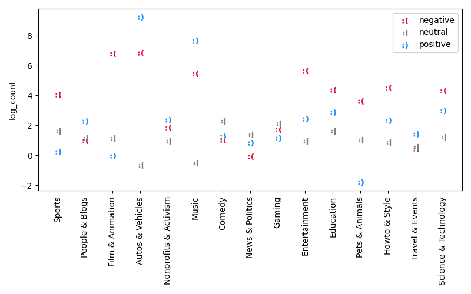
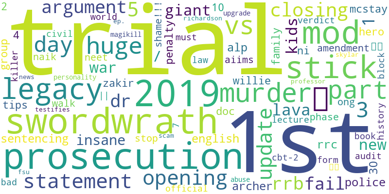
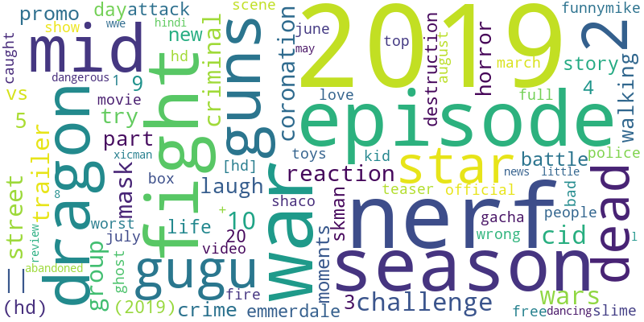
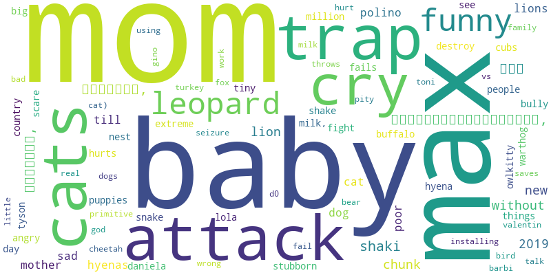

It all started on a normal lazy Sunday evening for the Team ADAGang. The friends gathered in front of a show, and the evening was slowly coming to an end. Suddenly, they received an intriguing message.

_Hello ADAGang,_

_I’m Alice. I am a big fan of YouTube. I kind of have developed a passion for the creation of videos and I thought that I should try myself to make a place in the YouTube game. Unfortunately, I have rapidly realized that it was not easy as it seemed. I have also noticed that I am rather lazy, and I would like to know the different tricks I could use to maximize my success on the platform without spending too much time working. And I suddenly had an idea!
With Youtube’s and Internet’s user experience, I have noticed that people are often saying that using a negative content can gather more attention. Can negativity bring me fame on YouTube?_

_Please ADAGang, I have heard about your talents, and I am sure that this question is so easy for to answer. I am going to pay you well!_

_Waiting for, I hope, an interesting and full of secrets answer from your side, I send you my best regards._


Hello Alice,

Your request really aroused our curiosity. We hesitated to accept your offer because your motivation is far from being lofty. You should rather work for your dreams to happen!
However, your cheque is so full of zeros that a negative answer was difficult to give (Matteo needs in fact a new car…). We decided then to accept this project, hoping that you will be able to reach your goal!

To answer your question, we will use the YouNiverse dataset [[ref]]. This huge dataset (over 100GB!) contains a lot of information about the videos and channels statistics through time. For efficiency reasons, we will only perform our analysis on one year, 2019. 


## What is negativity?

Without a precise definition, negativity can be difficult to represent. Throughout this project, we will use sentiment analysis on the titles and descriptions of the videos, using the natural language processing too Vader from NLTK. It computes scores of negativity, positivity and neutrality on texts. 
To represent in a better way what returns the sentiment intensity analysis, let's look at examples.

"You will never be a great YouTuber! You are lazy!"

Negative score: 0.477, Neutral score: 0.523, Positive score: 0.0

"We will bring so much you fame and success! You are great!"

Negative score: 0.0, Neutral score: 0.438, Positive score: 0.562

"We might or might not be able to help you."

Negative score: 0.0, Neutral score: 0.769, Positive score: 0.231


The examples illustrate what is linked with a highly negative or positive score obtain with the sentiment intensity. 


# First step of the analysis


_Okay, I see what's going on. What about my idea using negativity to gain success?_

[[...]]


Alice, we agree with you. We have also heard more than once that negativity can gather more attention on a content. However, to make sure that the further analysis are worth it, we have to verify that a difference in negative sentiment intensity score can be highlighted between the videos that make success on YouTube and the videos that do not. To do so, we use a dataset of videos from 2017 to 2018 that are in YouTube's trends [[give ref]].


_Why not videos from 2019?_

The dataset of trending videos from 2019 costs lots of money, and you didn't pay us enough for that.


_Okay, please go on._

Videos that reach the trends can be considered successful. [[In addition, the number of views and likes are the most observable and relevant factors that are considered in the YouTube’s algorithm to propel a video in the trends. Of course, this is far from being the only reason for a video to become a trending video. This is, however, an assumption that has been made to filter the successful and not successful videos of our dataset.]]

[[put plot]]

This figure shows clearly the difference of negative sentiment intensity between the videos that are successful and the ones that are not. This difference is observable in the titles and the descriptions. Obviously, the differences between the two groups are not big but they are statistically significant as the bootstrapped 95% confidence intervals around the mean value are small. There are not overlap between the intervals of the two group. The difference is not negligeable. Of course, a lot of other factors could cause this difference, but it is outside the scope of our work. This observation justifies the following analysis.


## [[regression coefficients]]


{:class="img-responsive"}

{:.image-caption}
*Coefficients in the linear regression for the log the the number of views, by video category. Be careful, all the points are statistically significant (p < 0.05) except the positive one for the category Film & Animation.*


## [[wordclouds]]

_I'm not sure how to make negative videos. Can you give me more advice?_

Let's look what negative videos that are successful talk about. [[...]]

{:class="img-responsive"}

{:.image-caption}
*Education*


{:class="img-responsive"}

{:.image-caption}
*Entertainment*


{:class="img-responsive"}

{:.image-caption}
*Howto & Style*


{:class="img-responsive"}

{:.image-caption}
*Pets & Animals*


_Can you be more precise? What are the topics?_

topic extraction




_channel evolution_

channel evolution


_But in the end, is negativity really a good way to make success?_

explanations about the size of the effect


This is a demo post to show you how to write blog posts with markdown.  I strongly encourage you to [take 5 minutes to learn how to write in markdown](https://markdowntutorial.com/) - it'll teach you how to transform regular text into bold/italics/headings/tables/etc.

**Here is some bold text**

## Here is a secondary heading

Here's a useless table:

| Number | Next number | Previous number |
| :------ |:--- | :--- |
| Five | Six | Four |
| Ten | Eleven | Nine |
| Seven | Eight | Six |
| Two | Three | One |


How about a yummy crepe?


It can also be centered!

{: .mx-auto.d-block :}

Here's a code chunk:

~~~
var foo = function(x) {
  return(x + 5);
}
foo(3)
~~~

And here is the same code with syntax highlighting:

```javascript
var foo = function(x) {
  return(x + 5);
}
foo(3)
```

And here is the same code yet again but with line numbers:


var foo = function(x) {
  return(x + 5);
}
foo(3)


## Boxes
You can add notification, warning and error boxes like this:

### Notification

{: .box-note}
**Note:** This is a notification box.

### Warning

{: .box-warning}
**Warning:** This is a warning box.

### Error

{: .box-error}
**Error:** This is an error box.
