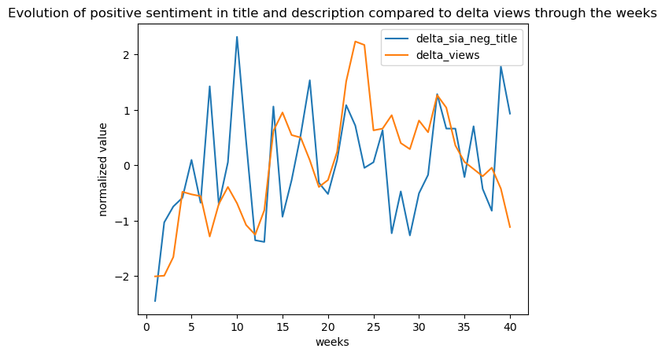
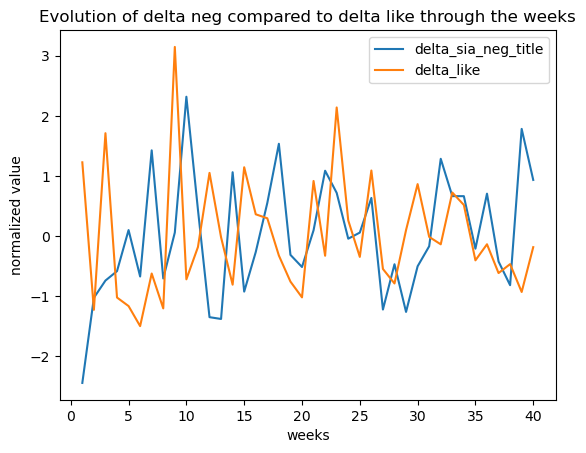

It all started on a normal lazy Sunday evening for the Team ADAGang. The friends gathered in front of a show, and the evening was slowly coming to an end. Suddenly, they received an intriguing message.

<i>

Hello ADAGang,

I’m Alice. I am a big fan of YouTube. I kind of have developed a passion for the creation of videos and I thought that I should try myself to make a place in the YouTube game. Unfortunately, I have rapidly realized that it was not easy as it seemed. I have also noticed that I am rather lazy, and I would like to know the different tricks I could use to maximize my success on the platform without spending too much time working. And I suddenly had an idea!
With Youtube’s and Internet’s user experience, I have noticed that people are often saying that using a negative content can gather more attention. Can negativity bring me fame on YouTube?

Please ADAGang, I have heard about your talents, and I am sure that this question is so easy for to answer. I am going to pay you well!

Waiting for, I hope, an interesting and full of secrets answer from your side, I send you my best regards.

</i>

Hello Alice,

Your request really aroused our curiosity. We hesitated to accept your offer because your motivation is far from being lofty. You should rather work for your dreams to happen!
However, your cheque is so full of zeros that a negative answer was difficult to give (Matteo needs in fact a new car…). We decided then to accept this project, hoping that you will be able to reach your goal!

To answer your question, we will use the [YouNiverse dataset](https://zenodo.org/record/4650046#.Y6YPLezMIUE). This huge dataset (over 100GB!) contains a lot of information about the videos and channels statistics through time. For efficiency reasons, we will only perform our analysis on one year, 2019. 

Without a precise definition, negativity can be difficult to represent. Throughout this project, we will use sentiment analysis on the titles and descriptions of the videos, using the natural language processing tool Vader from NLTK. It computes scores of intensity of three sentiments (egativity, positivity and neutrality) on texts. The scores are from 0 (no emotion) to 1 (very intense emotion).
To represent in a better way what returns the sentiment intensity analysis, let's look at some examples. The sentiment intensity of each sentence is in the column of the corresponding emoji.

| | 🙁 | 😐 | 🙂 |
| :-- | :------ |:--- | :--- |
| "You will never be a great YouTuber! You are lazy!" | 0.477 | 0.523 | 0.0 |
| "We might or might not be able to help you." | 0.0 | 0.769 | 0.231 |
| "We will bring so much you fame and success! You are great!" | 0.0 | 0.438 | 0.562 |

  

<i>
Okay, I see what's going on. What about my idea using negativity to gain success?
</i>

Alice, we agree with you. We have also heard more than once that negativity can gather more attention on a content. However, to make sure that the further analysis are worth it, we have to verify that a difference in negative sentiment intensity score can be highlighted between the videos that make success on YouTube and the videos that do not. To do so, we use a [dataset of videos](https://www.kaggle.com/code/ammar111/youtube-trending-videos-analysis) from 2017 to 2018 that are in YouTube's trends.

<i>
Why not videos from 2019?
</i>

The dataset of trending videos from 2019 costs lots of money, and you didn't pay us enough for that.

<i>
Okay, please go on.
</i>

Videos that reach the trends can be considered successful. In addition, the number of views and likes are the most observable and relevant factors that are considered in the [YouTube’s algorithm](https://blog.hootsuite.com/how-the-youtube-algorithm-works/) to propel a video in the trends. Of course, this is far from being the only reason for a video to become a trending video. The number of views and likes of the videos of this dataset are used to determine tresholds to filter successful videos from the created dataset. This is, however, an assumption that has been made to filter the successful and not successful videos of our dataset.

{:class="img-responsive"}

{:.image-caption}
*Comparison of the negativity sentiment intensity in the title and description between successful videos and not successful*

This figure shows clearly the difference of negative sentiment intensity between the videos that are successful and the ones that are not. This difference is observable in the titles and the descriptions. Obviously, the differences between the two groups are not big but they are statistically significant as the bootstrapped 95% confidence intervals around the mean value are small. There are not overlap between the intervals of the two group. The difference is not negligeable. Of course, a lot of other factors could cause this difference, but it is outside the scope of our work. This observation justifies the following analysis.

<i>
Can you give me a more fine-grained analysis? I suspect that negativity won't have the same effect for videos about pets or about politics. Also your division between successful and unsuccessful seems a bit arbirtary.
</i>

To overcome the issue of the splitting, we make a linear regression where the outcome is the number of views of a video and the predictors are the sentiment scores: positive, negative and neutral. Since the number of views follows a heavy-tailed distribution we use the logarithm of the number of views as the outcome, and we add one before taling the log to avoid -infinity values. We make a linear regression for each category of videos.

{:class="img-responsive"}

{:.image-caption}
*Coefficients in the linear regression for the log the the number of views, by video category. Be careful, all the points are statistically significant (p < 0.05) except the positive one for the category Film & Animation.*

This representationof the linear regression coefficients prove that the positivity and negativity induce more views in general. The results are, however, highly different between the categories. Negativity tends to be more correlated with larger amount of views than positivity. In Autos & Vehicules and Music, it is the opposite. Emotions perform better than neutrality for almost any categories.
Some results are also surprising. It News & Politics, negativity does not increase the number of views. It is the case for the categorie Pets & Animals. Alice, the categorie, you will choose could highly impact your success on the platform.

However we must take these conclusions with a grain of salt. The R-squared coefficient in our regressions range from 0.003 to 0.105, which means the regression does not fit the data very well. So we can conclude that although the effects of the different sentiments (negative, positive, neutral) on the number of views are significantly different, they are other factors that influence the number of views.

<i>
Thanks for your analysis. But I'm not sure how to make negative videos. Can you give me more advice?
</i>

Let's look at what negative videos that are successful talk about. We fix thresholds: a video is called "successful" if it is in the top 30% percent with respect to the number of views, and it is called "negative" if it is in the top 1% with respect to the intensity of the negative sentiment in the description. With these thresholds, successful videos are those with at least 9194 views and negative videos are those with a negative sentiment in the description of at least 0.281.

We select videos that are both successful and negative, and we look at the words in their titles. We apply standard NLP preprocessing (stopwords and punctuation removal, casefolding) and we create word clouds for each category of videos, using unigrams (single words). Word clouds are like histograms: the bigger a word is in the word cloud, the more frequently it appears in the video titles. We select four categories of videos where the word clouds are particularly insightful.

{:class="img-responsive"}

{:.image-caption}
*Education*

Videos in the category Education seem to talk a lot about law and crime :trial, prosecution, murder, 1st, penalty, police, abuse. The words "1st" and "amendment" appear often, they might designate the first amendment of the US constitution. So to make successful negative videos in this category it looks like speaking about criminal cases is a good advice.

{:class="img-responsive"}

{:.image-caption}
*Entertainment*

If you want to make negative and successful entertainment videos, it's (unsurpisingly) a good idea to focus on violent themes: fight, guns, dragon, war, dead.

{:class="img-responsive"}

{:.image-caption}
*Howto & Style*

Successful negative videos in the category Howto & Style talk often about body size (weight, loss, diet, belly, fat), which doesn't seem very nice. "Gun" sounds particularly alarming.

{:class="img-responsive"}

{:.image-caption}
*Pets & Animals*

We were surprised by the fact that negativity increases the success for videos in the category Pets & Animals. Here we understand how that's possible: videos seem to leverage on our feelings for cute animals in trouble (baby, mom, attack, cry).

<i>
Can you be more precise? What are the topics?
</i>

topic extraction



<i>
Alright. So will I be guaranteed to have success using negativity?
</i>

We've conducted an analysis on the 100 channels with the most views. Using the Youniverse dataset, we have access to the stats of each channel at some given points in time, such as the delta of their views and their subs. What we mean by "delta" is the difference between one week from the week before. We merged this dataframe with the videos to find, for each video uploaded at a given date, the closest stats of channels in the timeseries at that corresponding time. The idea was to have the stats for each video, in order to compute the deltas of sentiment through weeks. This way, we could see the evolution of the channels in time, in terms of views, subs and sentiment. We plotted some sample for you to see. Here, you can see the relative evolution of the negativity indice and delta of views throughout the year. Relative because we normalized all the deltas in order to fit on the same scale (views are often way larger values than sentiment indices). 

{:class="img-responsive"}

Let's focus on the title, as it is usually what catches the most the attention. This first plot shows for a random successful channel the evolution of its overall views throughout the year compared to the average sentiment indice of its video titles. As we can see, the correlation between the sentiment and the delta views is harde to determine. We can notice the curves following a similar distribution, for instance between week 20 and week 25. But at the same time, they follow a completely inversed distribution during other times such as between week 5 and week 10.

We can now observe the timeplot of negative sentiment compared other indices of success, such a like or subs.

{:class="img-responsive"}

{:class="img-responsive"}

We can observe from these plots that the delta like curve overlaps more with the delta sia curve, meaning that negativity might have a more significant impact on the number of likes. But at the same time, likes are usually fluctuating more as it is not a viarable that can be defined automatically such as views, but simply on the motivation of a viewer (a viewer that clicks on the video will not always gives his opinion on it with like/dislike). 

<i>
Great! But... what can I conclude from that?
</i>

As you can see, it is hard to see a clear visual correlation between the changes in sentiment and the success indices. This means that, changing your content from neutral to negative, both for title and description, wouldn't really imply that you would necessarly get more views or subs. This can be explained by the fact that content and time of upload is also to take into consideration. Posting a video on Christmas is not the same as posting a video on a monday afternoon. Posting a video about a specific trend is not the same as about a random fact that you are the only to know. Many confounders should be taken in consideration. Statistically, using sentiment in general is still more impactful than making a neutral video, but there is many other factors that could be deterministic for the success of your channel, especially if you're aiming for a long-term evolution. Negativity may be a point  of start, but this shouldn't be your only focus.

